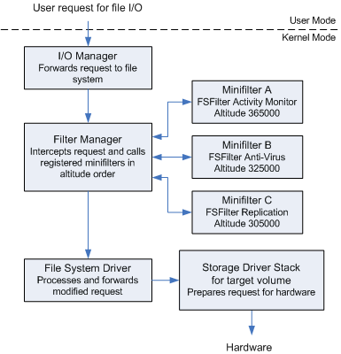

# SOTA-Minifilter Driver

A minifilter driver for the annual challenge on college.

# Table of Contents
1. [Description](#Description)
2. [External Code](#external-Code)
3. [What is a minifilter driver?](#What-is-a-minifilter-driver?)
4. [Build (Optional)](#Build-(Optional))

   4.1. [Pre-requisites to build](#Pre-requisites-to-build)
   
   4.2. [Steps to build](#Steps-to-build)
5. [**Instalation**](#Instalation)
   
   5.1 [**Pre-requisites to install and use it**](#Pre-requisites-to-install-and-use-it)
   
   5.2 [**Steps to install**](#Steps-to-install)
   

## Description

This minifilter tries to identify malicious processes by validating rules against all IRP sent to the filesystem.

## External Code

Files that were not written by me:

"uthash.h" and "utlist.h" from [troydhanson/uthash](https://github.com/troydhanson/uthash) **with the necessary kernel-space modifications made by be**.

## What is a minifilter driver?

Minifilter or any other File System Filter Driver intercepts and modifies requests directed at a file system or another filter driver. By intercepting these requests before they reach their intended destination, the filter driver can enhance or replace the functionality provided by the original target. These services are accessible via the Windows Filter Manager.

Example macro architecture of file system drivers:



## Build (Optional)
### Pre-requisites to build
| Name | Reason |
| ---------------------------------------------- | -- |
| [**Microsoft Visual Studio Build Tools for C++**](https://visualstudio.microsoft.com/thank-you-downloading-visual-studio/?sku=BuildTools&rel=16) | To develop and build C++ code, install "Desktop development with C++ |
| [**Windows SDK**](https://go.microsoft.com/fwlink/?linkid=2166460) | WDK needs a matching version of Windows SDK. |
| [**Windows Driver Kit (WDK)**](https://go.microsoft.com/fwlink/?linkid=2166289) | The base kit to develop a driver |
| (optional) [**LLVM and Clang**](https://github.com/llvm/llvm-project/releases/download/llvmorg-12.0.1/LLVM-12.0.1-win64.exe) | In the rust version of the driver, LLVM is needed to generate bindings for the Windows Driver API (bindgen) |

### Steps to build
1. Open the "MinifilterSOTA.sln" with [Visual Studio](https://visualstudio.microsoft.com/) and click "Build Solution".
2. The default output is "x64\Debug\MinifilterSOTA" directory.

   
## Instalation
### Pre-requisites to install and use it
| Name | Reason |
| ---------------------------------------------- | -- |
| [**Disable Secure Boot**](https://learn.microsoft.com/en-us/windows-hardware/drivers/install/the-testsigning-boot-configuration-option) | To make Microsoft Windows accepts self-signed drivers |
| [**Enable Driver Testing Mode**](https://learn.microsoft.com/en-us/windows-hardware/drivers/install/the-testsigning-boot-configuration-option) | To make Microsoft Windows accepts self-signed drivers |
| (optional) [**Sysinternals DebugView**](https://docs.microsoft.com/en-us/sysinternals/downloads/debugview) | DebugView to see kernel debug messages |

### Steps to install
1. Deploy [the three files from the release page](https://github.com/not4rt/SOTA-minifilter/releases) (or the files you built) to the target machine.
2. Right-click on "MinifilterSOTA.inf" and choose "Install". **Alternatively**, you can run the following on an elevated powershell:
   ```powershell
   pnputil -i -a "<path>/MinifilterSOTA.inf"
   ```
3. Click "install" on the windows that pops up.
4. Reboot your system.

